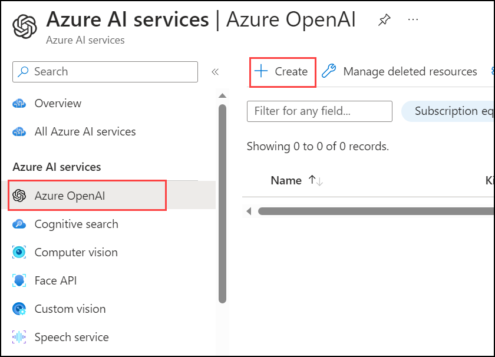
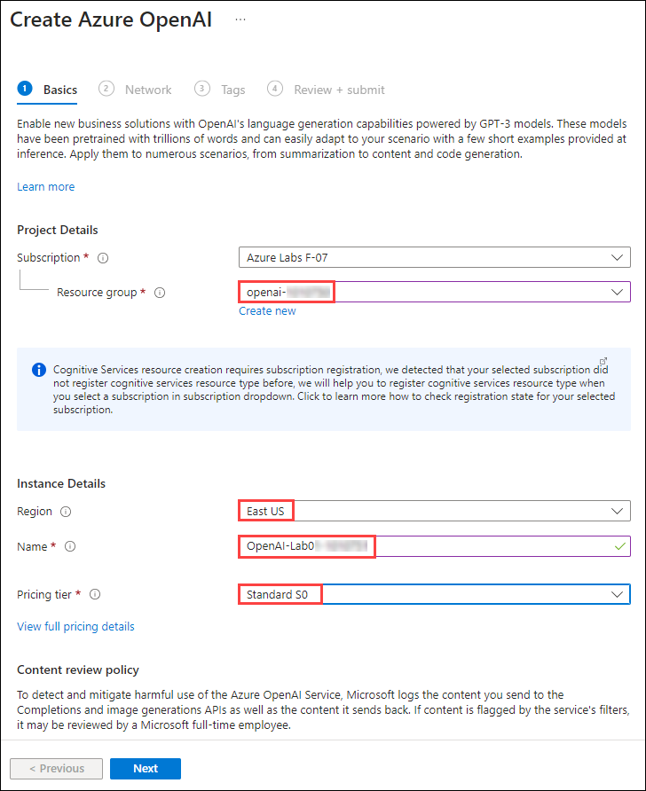
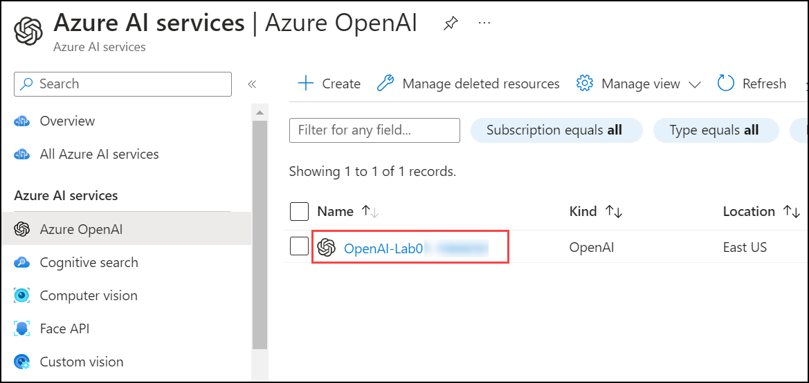
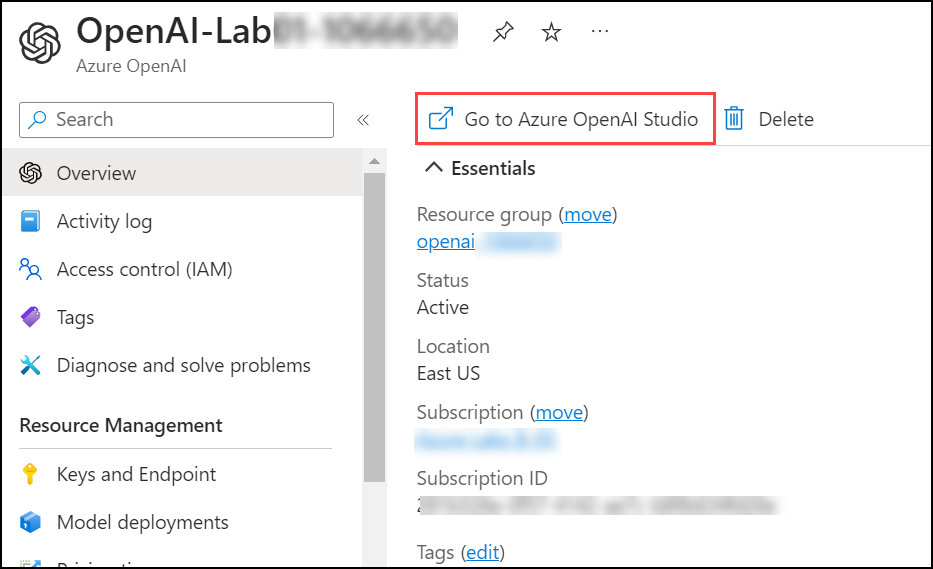
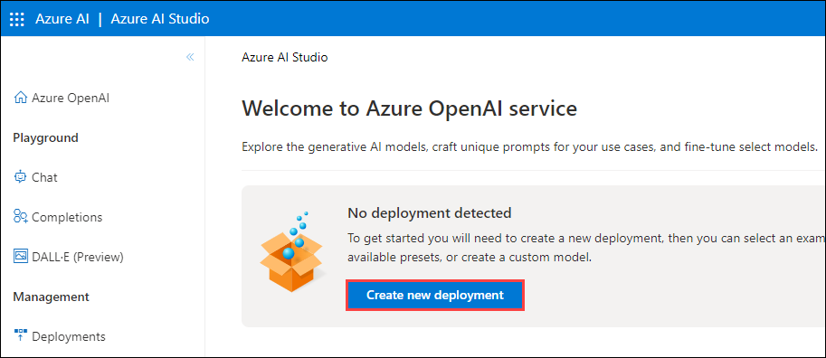
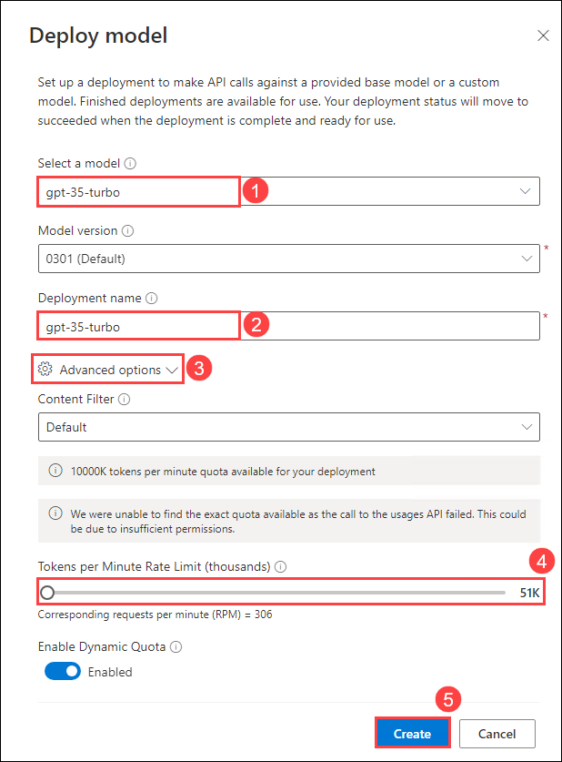
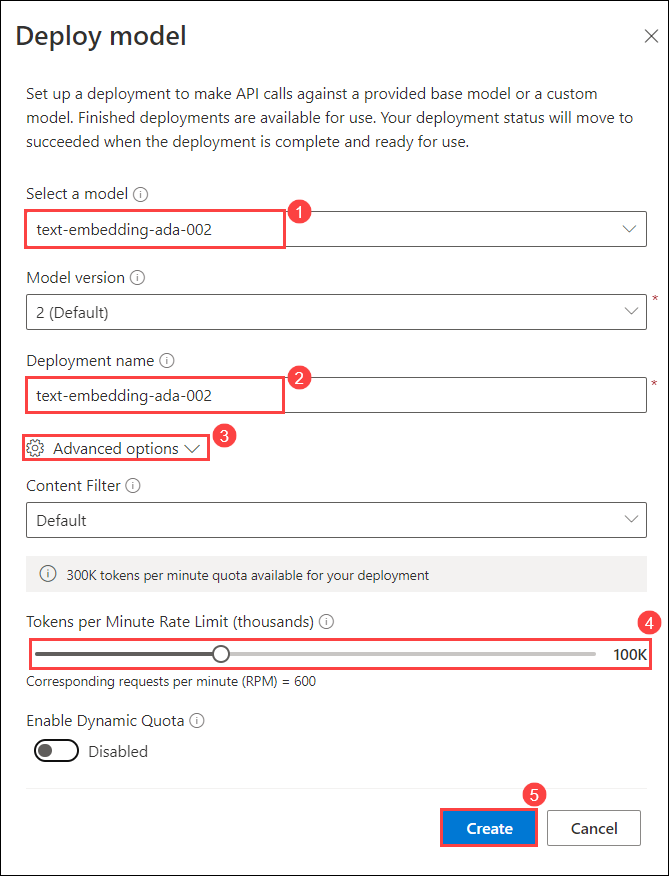

# Exercise 1: Getting Started with Azure OpenAI

In this exercise, you will create a deployment and model in Azure OpenAI studio which you will be using in further exercises.
   
## Task 1: Deploy Azure OpenAI Model.

1. In the **Azure portal**, search for **OpenAI** and select **Azure OpenAI**.

   

2. On **Azure AI Services | Azure OpenAI** blade, click on **Create**.

   

3. Create an **Azure OpenAI** resource with the following settings:
   
    - **Subscription**: Default - Pre-assigned subscription.
    - **Resource group**: Intelligent-apps-<inject key="Deployment ID" enableCopy="false"></inject>
    - **Region**: Select **<inject key="Region" enableCopy="false" />**
    - **Name**: OpenAI-<inject key="Deployment ID" enableCopy="false"></inject>
    - **Pricing tier**: Standard S0
  
      

4. Wait for deployment to complete. Then go to the deployed Azure OpenAI resource in the Azure portal.

### Task 2: Deploy a model

Azure OpenAI provides a web-based portal named **Azure OpenAI Studio**, that you can use to deploy, manage, and explore models. You'll start your exploration of Azure OpenAI by using Azure OpenAI Studio to deploy a model.

1. In the **Azure portal**, search for **OpenAI** and select **Azure OpenAI**.

   

2. On **Azure AI Services | Azure OpenAI** blade, select **OpenAI-Lab01-<inject key="Deployment-id" enableCopy="false"></inject>**

   

3. In the Azure OpenAI resource pane, click on **Go to Azure OpenAI Studio** it will navigate to **Azure AI Studio**.

   
   
5. In **Welcome to Azure OpenAI Service** page, click on **Create new deployment**.

   

6. In the **Deployments** page, click on **+ Create new deployment**.

   

7. Within the **Deploy model** pop-up interface, enter the following details and then click on **Advanced options (3)** followed by scaling down the **Tokens per Minute Rate Limit (thousands) (4)**:
    
    - **Select a Model**: gpt-35-turbo
    - **Model version**: Auto-update to default
    - **Deployment name**: gpt-35-turbo
    - **Tokens per Minute Rate Limit (thousands)**: 40K

      

8. Click on the **Create** button to deploy a model that you will be playing around with as you proceed.

9. In the **Deployments** page, click on **+ Create new deployment**.

   

10. Within the **Deploy model** pop-up interface, enter the following details and then click on **Advanced options (3)** followed by scaling down the **Tokens per Minute Rate Limit (thousands) (4)**:
    
    - **Select a Model**: text-embedding-ada-002
    - **Model version**: 2(Default)
    - **Deployment name**: text-embedding-ada-002
    - **Tokens per Minute Rate Limit (thousands)**: 40K
  
      

11. Click on the **Create** button to deploy a model that you will be playing around with as you proceed.

> **Note**: Azure OpenAI includes multiple models, each optimized for a different balance of capabilities and performance. In this exercise, you'll use the **GPT-35-Turbo** model, which is a good general model for summarizing and generating natural language and code. For more information about the available models in Azure OpenAI, see [Models](https://learn.microsoft.com/azure/cognitive-services/openai/concepts/models) in the Azure OpenAI documentation.
