# Lab 1: Prompt Engineering practices

Master the art of Prompt Engineering with Azure OpenAI Studio. In this exercise, you'll explore the concept of prompt engineering, learning how to craft effective prompts for AI models. You'll get hands-on experience with Azure OpenAI Playground, experimenting with different types of prompts and understanding their elements and design tips.

### Task 1: German Translation

1. In [Azure OpenAI Studio](https://oai.azure.com/?azure-portal=true), navigate to the **Chat** playground in the left pane.

1. In the **Assistant setup** section at the top, enter the following as the system message and click on **Save**.

   ```
   You are an AI assistant designed to assist with German translation.
   ```

   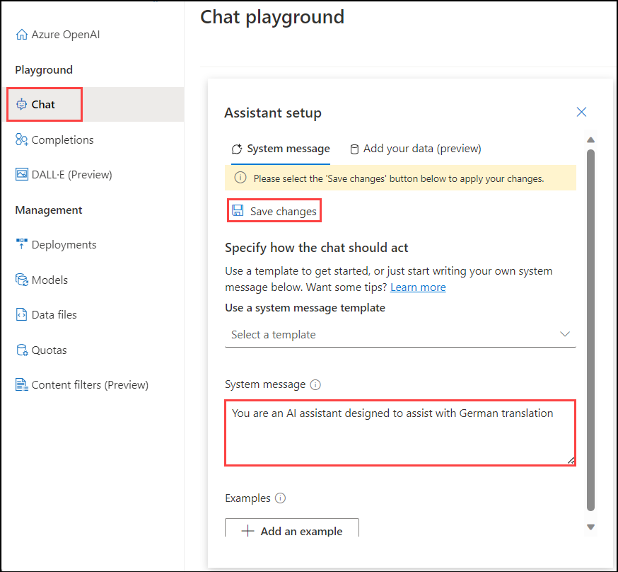

1. In the pop-up **Update system message?**, check the box **Don't show this again**, and click on **Continue**

   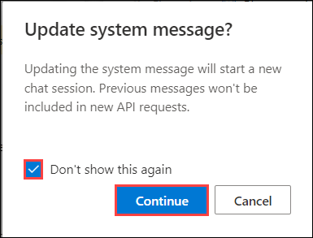

1. In the **Chat session** section, enter the following prompt and press **Enter**.

   ```
   I was enjoying the sun, but then a huge cloud came and covered the sky.
   ```

   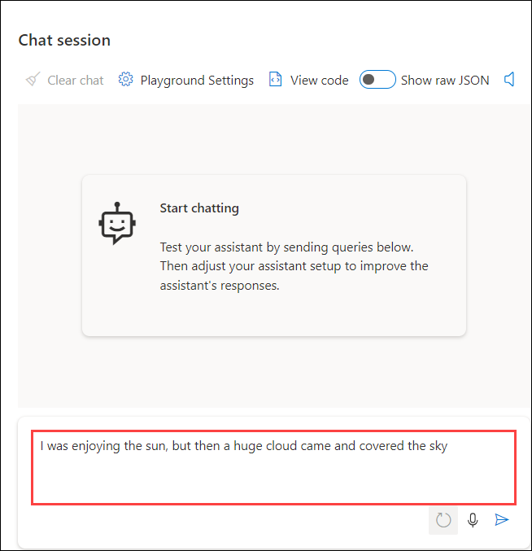

1. The model will likely respond with an answer to satisfy the prompt.

   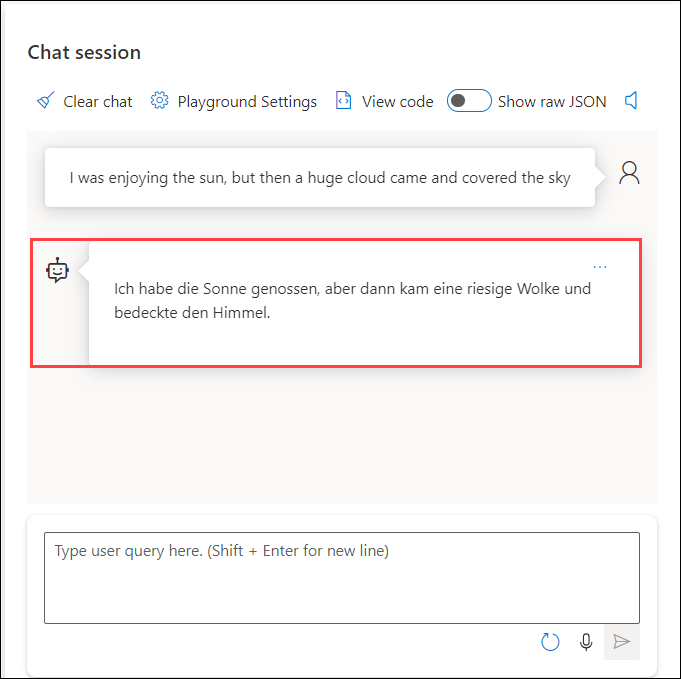

   > **Note**: Chat may not respond with the exact output as shown in the screenshots.

### Task 2: Negation

1. In the **Assistant setup** section at the top, enter the following as the system message.

   ```
   You are an AI assistant that helps to negate the given sentence.
   ```

1. In the **Chat session** section, enter the following prompt and press **Enter**.

   ```
   I was enjoying the sun, but then a huge cloud came and covered the sky.
   ```

1. The model will likely respond with an answer to satisfy the prompt.

   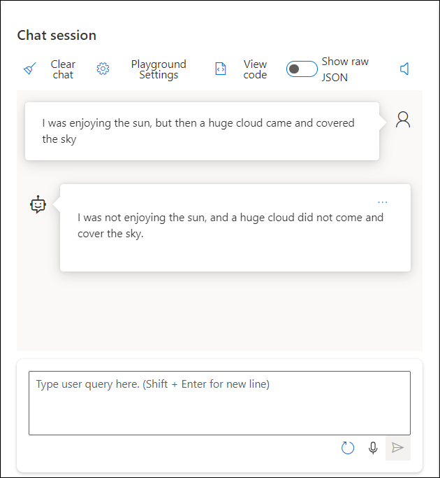

   > **Note**: Chat may not respond with the exact output as shown in the screenshots.   

### Task 3: Classification

1. In the **Assistant setup** section at the top, enter the following as the system message.

   ```
   You are an AI assistant that helps people to Classification the statement
   ```

1. In the **Assistant setup** section near the system message, select the **Add an example** button. Add the following example and Click on **Save**.

    **User:**

    ```
    Despite facing unexpected challenges in the project, our team demonstrated resilience and dedication, resulting in a positive outcome that exceeded expectations; however, we must address some concerns raised by stakeholders to ensure future success
    ```

    **Assistant:**

    ```
    Positive: 0.65
    Neutral: 0.20
    Negative: 0.15
    ```
  
1. In the **Chat session** section, enter the following prompt and press **Enter**.

   ```
   Not much to write about here, but it does exactly what it's supposed to. filters out the pop sounds. now my recordings are much more crisp. it is one of the lowest prices pop filters on amazon so might as well buy it, they honestly work the same despite their pricing.
   ```

1. The model will likely respond with an answer to satisfy the prompt.

   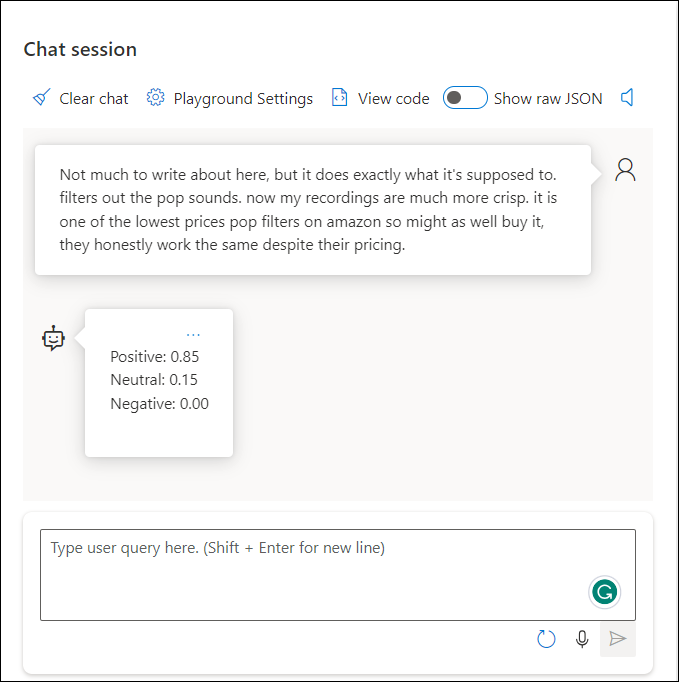

   > **Note**: Chat may not respond with the exact output as shown in the screenshots.

### Task 4: E-Mail Summarization 

1. In the **Assistant setup** section at the top, enter the following as the system message.

   ```
   You are an AI assistant that helps people summarize emails.
   ```

1. In the **Assistant setup** section near the system message, select the **Add an example** button. Add the following example and click on **Save**.

    **User:**

    ```
    Summary: XYZ
    Open Questions: XYZ
    Action Items: XYZ 
    ```
  
1. In the **Chat session** section, navigate to the following link from the following link same sample mail [sample mail](https://news.microsoft.com/2022/01/18/satya-nadella-email-to-employees-bringing-the-joy-and-community-of-gaming-to-everyone/) copy paste the sample mail-in the prompt and press **Enter**.
  
1. The model will likely respond with an answer to satisfy the prompt.

   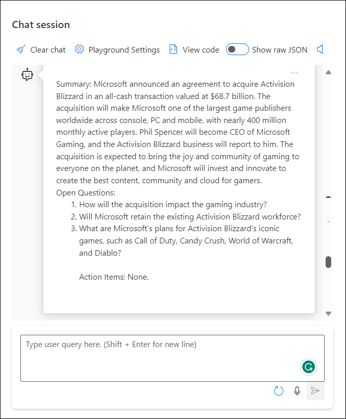

   > **Note**: Chat may not respond with the exact output as shown in the screenshots.

### Task 5: Rewriting

1. In the **Assistant setup** section at the top, enter the following as the system message and click on **Save**.

   ```
   You are an AI assistant that helps to change the perspective from first-person to third-person 
   ```

1. In the **Chat session** section, enter the following prompt and press **Enter**.

   ```
   I was enjoying the sun, but then a huge cloud came and covered the sky.
   ```
  
1. The model will likely respond with an answer to satisfy the prompt.

   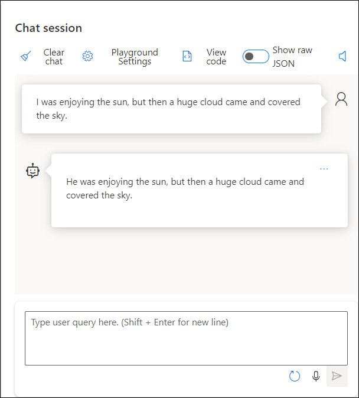

   > **Note**: Chat may not respond with the exact output as shown in the screenshots.

### Task 6: Multiple Tasks

1. In the **Assistant setup** section at the top, enter the following as the system message and click on **Save**.

   ```
   You are an AI assistant that helps to provide three variations of the given text: one translated into German, one with the negation of the original meaning in English, and one with the perspective changed from first-person to third-person in a structured format. 
   ```

1. In the **Chat session** section, enter the following prompt and press **Enter**.

   ```
   I was enjoying the sun, but then a huge cloud came and covered the sky.
   ```
  
1. The model will likely respond with an answer to satisfy the prompt.

   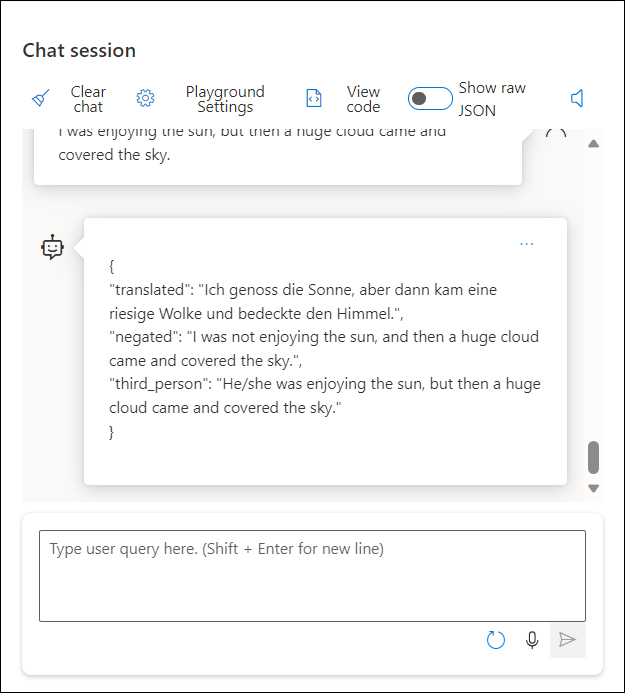

   > **Note**: Chat may not respond with the exact output as shown in the screenshots.

### Task 7: Data extraction to JSON

1. In the **Assistant setup** section at the top, enter the following as the system message.

   ```
   You are an AI assistant that helps extract relevant information from the provided text and organize it in a structured format. Classify the reason for the request JSON format.
   ```

1. In the **Assistant setup** section near the system message, select the **Add an example** button. Add the following example and Click on **Save**.

   **User:**

   ```
   {
   "reason": "xyz",
   "classified_reason": "x_y",
   "name": "xyz",
   "ssn": "123",
   "dob": "01/02/1234"
   }
   ```

1. In the **Chat session** section, enter the following prompt and press **Enter**.

   ```
   Hello, my name is Mateo Gomez. I lost my Credit card on August 17th, and I would like to request its cancellation. The last purchase I made was of a Chicken parmigiana dish at Contoso Restaurant, located near the Hollywood Museum, for $40. Below is my personal information for validation:  
   Profession: Accountant  
   Social Security number is 123-45-6789  
   Date of birth: 9/9/1989  
   Phone number: 949-555-0110  
   Personal address: 1234 Hollywood Boulevard Los Angeles CA  
   Linked email account: mateo@contosorestaurant.com  
   Swift code: CHASUS33XXX
   ```
  
1. The model will likely respond with an answer to satisfy the prompt.

   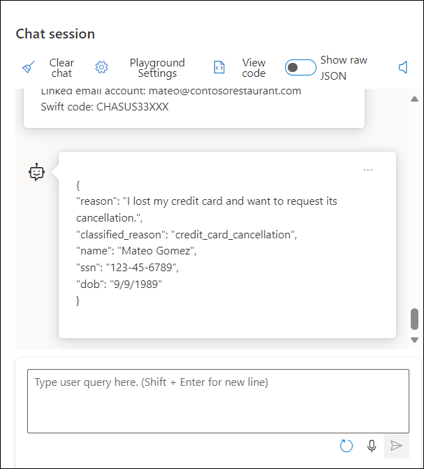

   > **Note**: Chat may not respond with the exact output as shown in the screenshots.

### Task 8: Fashion product description  

1. In the **Assistant setup** section at the top, enter the following as the system message and click on **Save**.

   ```
   You are an AI assistant that helps to create a promotional message with specified details 
   ```

1. In the **Chat session** section, enter the following prompt and press **Enter**.

   ```
   Season: Winter
   Style: Sweater
   Gender: Female
   Target group: Teenager
   Material: Cotton
   ```
  
1. The model will likely respond with an answer to satisfy the prompt.

   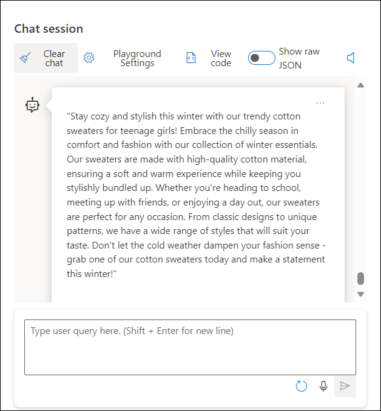

   > **Note**: Chat may not respond with the exact output as shown in the screenshots.

### Task 9: Write a Blog Post

1. In the **Assistant setup** section at the top, enter the following as the system message and click on **Save**.

   ```
   You are an AI assistant that helps to write a blog post with a relatable hashtag. 
   ```

1. In the **Chat session** section, enter the following prompt or any topic of yours and press **Enter**.

   ```
   Azure OpenAI
   ```
  
1. The model will likely respond with an answer to satisfy the prompt.

   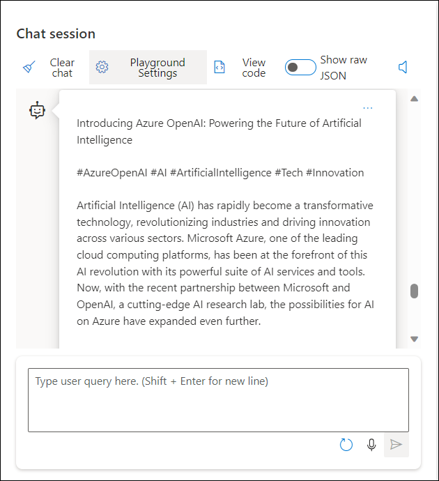

   > **Note**: Chat may not respond with the exact output as shown in the screenshots.

### Task 10: Call Center

1. In the **Assistant setup** section at the top, enter the following as the system message and click on **Save**.

   ```
   You are an AI assistant helps to extract relevant information and details from the customer service conversation and organize them into a structured format. Include information such as the reason for the call, the resolution status, a summary of the call, customer and employee names, order number, customer contact information, sentiment analysis, satisfaction scores, estimated time of arrival (ETA), and action items.
   ```

1. In the **Chat session** section, enter the following prompt and press **Enter**.

   ```
   Employee: "Hello, this is Julia Schreider from Contoso Company. How can I help you today?"
   Customer: "Hi, I am Carsten Mueller. I ordered a package 10 days ago, on February 10th, and it was supposed to arrive in maximum 5 business days. I have called three times already and nobody could provide any more information. I want to know where the package is and I want the problem to be solved immediately. This is the worst service I had for a long time!"
   Employee: "I apologize for the inconvenience, Mr. Mueller. I understand your frustration and I'm here to help. Can you please provide me with your order number so I can look into this for you?"
   Customer: "Yes, it's ACZ456789."
   Employee: "Thank you. I'm looking into it now. Can you please hold for a few minutes while I check the status of your package?"
   Customer: "Okay."
   Employee: "Thank you for your patience. I am sorry to inform you that I am unable to find the status of your package. It appears to have left the sending address, but no up-to-date status on the current location. I will further investigate your case and get back to you as soon as possible via phone call. Could you please provide me your contact information?"
   Customer: "Ah not again. Anyway, my phone number is +4911112223344."
   Employee: "I apologize again for the inconvenience. Is there anything else I can help you with today?"
   Customer: "No."
   Employee: "Thank you. Have a great day!"
   ```
  
1. The model will likely respond with an answer to satisfy the prompt.

   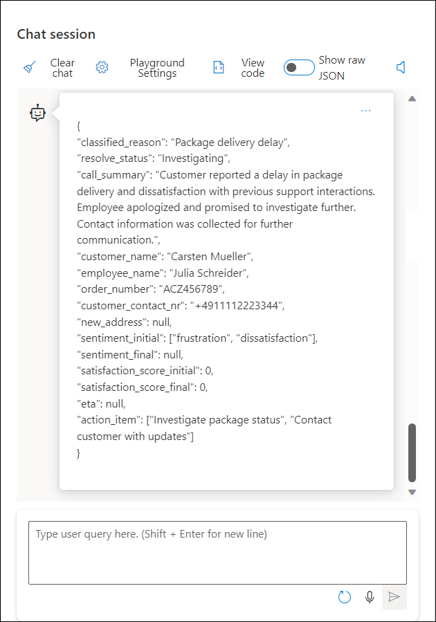

   > **Note**: Chat may not respond with the exact output as shown in the screenshots.

### Task 11: Few-shot learning 

1. In the **Assistant setup** section at the top, enter the following as the system message.

   ```
   You are an AI assistant that helps to classify a movie summary
   ```

1. In the **Assistant setup** section near the system message, select the **Add an example** button. Add the following example and Click on **Save**.

    **User:**

    ```
    Paul Atreides, a brilliant and gifted young man born into a great destiny beyond his understanding, must travel to the most dangerous planet in the universe to ensure the future of his family and his people. As malevolent forces explode into conflict over the planet's exclusive supply of the most precious resource in existence-a commodity capable of unlocking humanity's greatest potential-only those who can conquer their fear will survive.
    ['Action', 'Adventure', 'Science Fiction’]

    A botched store robbery places Wonder Woman in a global battle against a powerful and mysterious ancient force that puts her powers in jeopardy.
    ['Action', 'Adventure', 'Fantasy']

    After the devastating events of Avengers: Infinity War, the universe is in ruins due to the efforts of the Mad Titan, Thanos. With the help of remaining allies, the Avengers must assemble once more in order to undo Thanos' actions and restore order to the universe once and for all, no matter what consequences may be in store.
    ['Adventure', 'Science Fiction', 'Action']

    A widowed new dad copes with doubts, fears, heartache and dirty diapers as he sets out to raise his daughter on his own. Inspired by a true story.
    ['Drama', 'Family', 'Comedy’]
    ```

1. In the **Chat session** section, enter the following prompt and press **Enter**.

   ```
   Harry, Ron, and Hermione walk away from their last year at Hogwarts to find and destroy the remaining Horcruxes, putting an end to Voldemort's bid for immortality. But with Harry's beloved Dumbledore dead and Voldemort's unscrupulous Death Eaters on the loose, the world is more dangerous than ever.  
   ```
  
1. The model will likely respond with an answer to satisfy the prompt.

   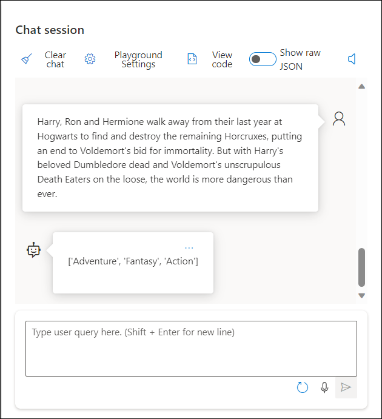

   > **Note**: Chat may not respond with the exact output as shown in the screenshots.

### Task 12: NL to SQL with Codex

1. In the **Assistant setup** section at the top, enter the following as the system message and click on **Save**.

   ```
   You are an AI assistant that helps to generate SQL query that returns the top 10 orders and show the customer name
   ```

1. In the **Chat session** section, enter the following prompt and press **Enter**.

   ```
   customer // Columns: firstname, name, customer_id, address  
   orders // Columns: order_id, customer_id, product_id, product_amount  
   products // Columns: product_id, price, name, description
   ```
  
1. The model will likely respond with an answer to satisfy the prompt.

   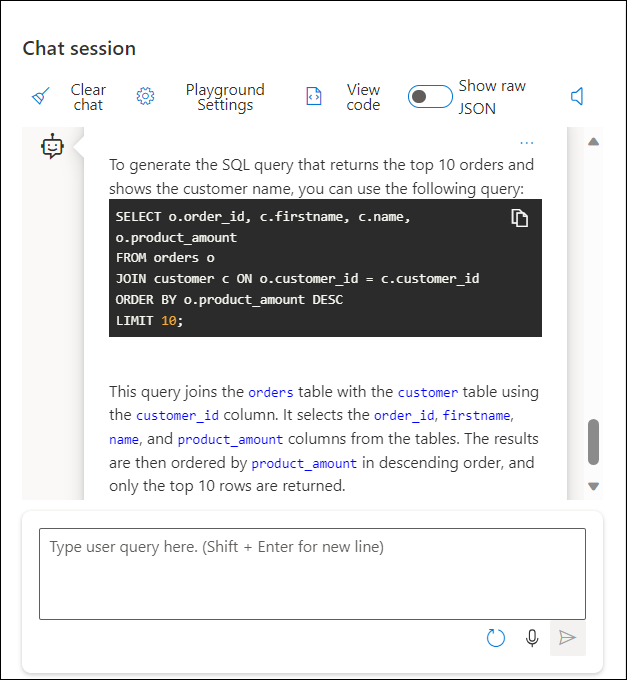

   > **Note**: Chat may not respond with the exact output as shown in the screenshots.
