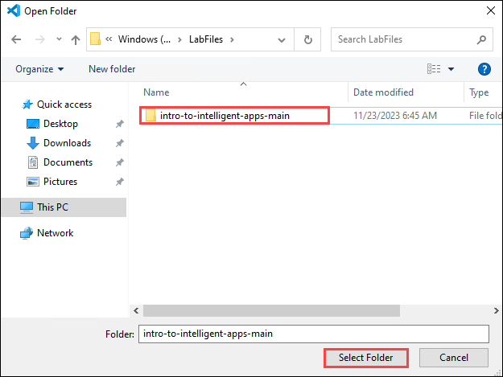
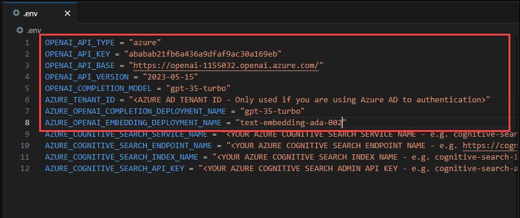
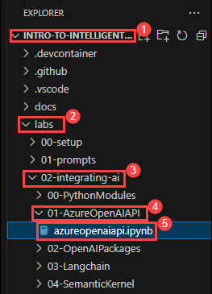
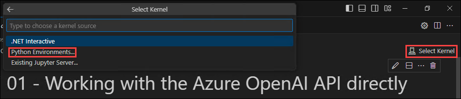
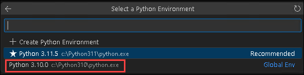
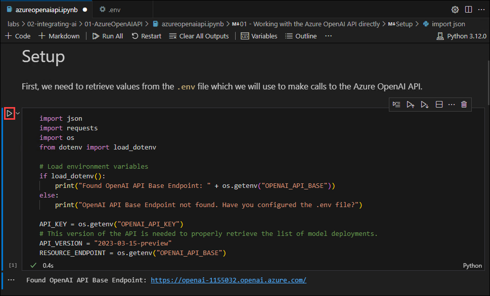
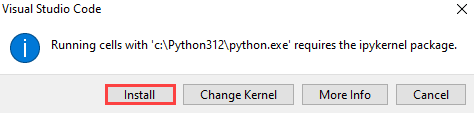
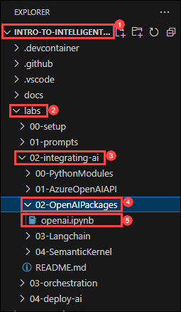
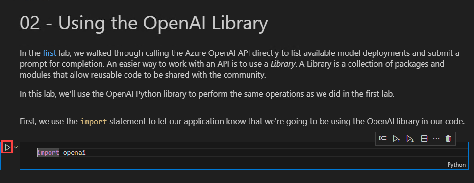

# 4a Interacting with Azure OpenAI APIs with Python

Discover the power of Azure OpenAI APIs by seamlessly integrating them into your Python projects. Leverage cutting-edge natural language processing and machine learning capabilities to enhance your applications. Unlock a new realm of possibilities for text generation, language understanding, and more, all within the Azure ecosystem.

### Task 1: Setup configuration for Integrating AI

1. Open **Visual Studio Code** from the Lab VM desktop by double-clicking on it.

   

1. In Visual Studio Code from menu bar select **File(1)>open folder(2)**.   

   

1. Within **File Explorer**, navigate to **C:\LabFiles** select **intro-to-intelligent-apps-main**(1) click on **Select folder(2)**

   

1. In **Visual Studio Code**, click on **Yes, I trust the authors** when **Do you trust the authors of the files in this folder?** window prompted.

   

1. Click on **.env**, replace the values and save the file by pressing **ctrl + s**.

   | **Variables**                            | **Values**                                                                              |
   | ---------------------------------------- |-----------------------------------------------------------------------------------------|
   | OPENAI_API_TYPE                          |  **azure**                                                                              |
   | OPENAI_API_KEY                           | Replace the value with the **AZURE OPENAI API KEY** which you noted in Task 2 step 3    |
   | OPENAI_API_BASE                          | Replace the value with the **AZURE OPENAI ENDPOINT** which you noted in Task 2 step 3   |
   | OPENAI_COMPLETION_MODEL                  | **gpt-35-turbo**                                                                        |
   | AZURE_OPENAI_COMPLETION_DEPLOYMENT_NAME  | **gpt-35-turbo**                                                                        |
   | AZURE_OPENAI_EMBEDDING_DEPLOYMENT_NAME   | **text-embedding-ada-002**                                                              |

   > **Note**: Please make sure to remove **/** From the **OPENAI_API_BASE**.

   

### Task 2: Azure OpenAI API

In this Task, we'll walk through showing how to interact with an Azure OpenAI API service endpoint. This will not likely be the best option for most scenarios, but it highlights what a direct call to the underlying rest-based API looks like and will give you an appreciation of what's going on behind the scenes when you use the orchestrators in the other exercises.

1. In the Visual Studio Code navigate to **intro-to-intelligent-apps-main/labs/02-integrating-ai/01-AzureOpenAIAPI** folder and select **azureopenaiapi.ipynb**

   

1. From the right corner click on **select Kernal** and on the Choose a Kernel source pop-up, select **Python Environment**. This will initiate the installation of the extension.

   

1. Next, on the Select a **Python Environment** pop-up, select avaiable **Python 3.10.0** env. This will set the Python Environment.

   

1. **Execute the notebook cell by cell** (using either Ctrl + Enter to stay on the same cell or Shift + Enter to advance to the next cell) and observe the **results of each cell** execution.
  
   > **Note**: Make sure **Python Environmen** is in ready State, If not please wait for 15 to 20 seconds.

      

   > **Note**: If any pop-up **Running cells with 'c:\Python312\python.exe' requires the ipykernel package**, click on **Install**.

      

### Task 3: OpenAI Packages

In this task, we'll show how to interact with the Azure OpenAI API using the OpenAI Python library. This will provide some insight into the configuration and setup that is needed to use one of these higher-level abstraction frameworks.

1. In the Visual Studio Code navigate to **intro-to-intelligent-apps-main/labs/02-integrating-ai/02-OpenAIPackages** folder and select **openai.ipynb**

   

1. From the right corner click on **select Kernal** and on the Choose a Kernel source pop-up, select available **Python 3.10.0** env. This will set the Python Environment.

   

1. **Execute the notebook cell by cell** (using either Ctrl + Enter to stay on the same cell or Shift + Enter to advance to the next cell) and observe the **results of each cell** execution.
  
   > **Note**: Make sure **Python Environmen** is in ready State, If not please wait for 15 to 20 seconds.

      
   
