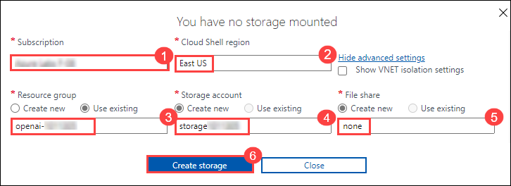

## Lab 04b: Generate and improve code with Azure OpenAI Service

### Lab scenario
The Azure OpenAI Service models can generate code for you using natural language prompts, fixing bugs in completed code, and providing code comments. These models can also explain and simplify existing code to help you understand what it does and how to improve it.

### Lab objectives
In this lab, you will complete the following tasks:

- Task 1: Generate code in chat playground
- Task 2: Set up an application in Cloud Shell
- Task 3: Configure your application
- Task 4: Run your application

### Estimated time: 30 minutes

### Task 1: Generate code in chat playground

Before using in your app, examine how Azure OpenAI can generate and explain code in the chat playground.

1. In [Azure OpenAI Studio](https://oai.azure.com/?azure-portal=true), navigate to the **Chat** playground in the left pane.
1. In the **Assistant setup** section at the top, select the **Default** system message template and click on continue.
1. Scroll down and in the **Chat session** section, enter the following prompt and press *Enter*.

    ```code
   Write a function in python that takes a character and string as input, and returns how many times that character appears in the string
    ```

1. The model will likely respond with a function, with some explanation of what the function does and how to call it.
1. Next, send the prompt `Do the same thing, but this time write it in C#`.
1. Observe the output. The model likely responded very similarly as the first time, but this time coding in C#. You can ask it again for a different language of your choice, or a function to complete a different task such as reversing the input string.
1. Next, let's explore using AI to understand code with this example of a random function you saw written in Ruby. Send the following prompt as the user message.

    ```code
    What does the following function do?  
    ---  
    def random_func(n)
      start = [0, 1]
      (n - 2).times do
        start << start[-1] + start[-2]
      end
      start.shuffle.each do |num|
        puts num
      end
    end
    ```

1. Observe the output, which explains what the function does in natural language. Try asking the model to rewrite it in a language you are familiar with.

### Task 2: Set up an application in Cloud Shell

To show how to integrate with an Azure OpenAI model, we'll use a short command-line application that runs in Cloud Shell on Azure. Open up a new browser tab to work with Cloud Shell.

1. In the [Azure portal](https://portal.azure.com?azure-portal=true), select the **[>_]** (*Cloud Shell*) button at the top of the page to the right of the search box. A Cloud Shell pane will open at the bottom of the portal.

   

2. The first time you open the Cloud Shell, you may be prompted to choose the type of shell you want to use (*Bash* or *PowerShell*). Select **Bash**. If you don't see this option, skip the step.  

3. If you're prompted to create storage for your Cloud Shell, ensure your subscription is specified and then select **Advanced settings**.

   

4. Within the **Advanced settings** pane, enter the following details:
    - **Subscription**: Default- Choose the only existing subscription assigned for this lab (1).
    - **CloudShell region**: East US (2)
    - **Resource group**: Select **Use existing**.(3)
      - openai-<inject key="Deployment-id" enableCopy="false"></inject>
    - **Storage account**: Select **Create new**.(4)
      - storage<inject key="Deployment-id" enableCopy="false"></inject>
    - **File share**: Create a new file share named **none** (5)
    - Click **Create Storage** (6)

    

5. Make sure the type of shell indicated on the top left of the Cloud Shell pane is switched to *Bash*. If it's *PowerShell*, switch to *Bash* by using the drop-down menu.

6. Once the terminal starts, enter the following command to download the sample application and save it to a folder called `azure-openai`.

    ```bash
   rm -r azure-openai -f
   git clone https://github.com/MicrosoftLearning/mslearn-openai azure-openai
    ```

7. The files are downloaded to a folder named **azure-openai**. Navigate to the lab files for this exercise using the following command.

    ```bash
   cd azure-openai/Labfiles/04-code-generation
    ```

    Applications for both C# and Python have been provided, as well as sample code we'll be using in this lab.

    Open the built-in code editor, and you can observe the code files we'll be using in `sample-code`. Use the following command to open the lab files in the code editor.

    ```bash
   code .
    ```

     >**Congratulations** on completing the task! Now, it's time to validate it. Here are the steps:
     > - Navigate to the Lab Validation tab, from the upper right corner in the lab guide section.
     > - Hit the Validate button for the corresponding task. If you receive a success message, you can proceed to the next task. 
     > - If not, carefully read the error message and retry the step, following the instructions in the lab guide.
     > - If you need any assistance, please contact us at labs-support@spektrasystems.com.

### Task 3: Configure your application

For this exercise, you'll complete some key parts of the application to enable using your Azure OpenAI resource.

1. In the code editor, expand the language folder for your preferred language.

2. Open the configuration file for your language.

    - **C#**: `appsettings.json`
    - **Python**: `.env`

3. Update the configuration values to include the **endpoint** and **key** from the Azure OpenAI resource you created, as well as the name of your deployment, `35turbo`. Then save the file by right-clicking on the file from the left pane and hit **Save**.

4. Navigate to the folder for your preferred language and install the necessary packages.

    **C#**

    ```bash
   cd CSharp
   dotnet add package Azure.AI.OpenAI --version 1.0.0-beta.9
    ```

    **Python**

      ```bash
    cd Python
    pip install python-dotenv
    pip install openai==1.2.0
    ```

5. Select the code file in this folder for your language and add the necessary libraries.

    **C#**

    `Program.cs`

    ```csharp
   // Add Azure OpenAI package
   using Azure.AI.OpenAI;
    ```

    **Python**

    `code-generation.py`

    ```python
    # Add OpenAI import
    from openai import AzureOpenAI
    ```

6. Add the necessary code for configuring the client.

    **C#**
    `Program.cs`

   ```csharp
   // Initialize the Azure OpenAI client
   OpenAIClient client = new OpenAIClient(new Uri(oaiEndpoint), new AzureKeyCredential(oaiKey));
    ```

    **Python**
     `code-generation.py`

      ```python
    # Set OpenAI configuration settings
    client = AzureOpenAI(
            azure_endpoint = azure_oai_endpoint, 
            api_key=azure_oai_key,  
            api_version="2023-05-15"
            )
    ```

8. In the function that calls the Azure OpenAI model, add the code to format and send the request to the model.

    **C#**

    ```csharp
    // Create chat completion options
    var chatCompletionsOptions = new ChatCompletionsOptions()
    {
        Messages =
        {
            new ChatMessage(ChatRole.System, systemPrompt),
            new ChatMessage(ChatRole.User, userPrompt)
        },
        Temperature = 0.7f,
        MaxTokens = 1000,
        DeploymentName = oaiModelName
    };

    // Get response from Azure OpenAI
    Response<ChatCompletions> response = await client.GetChatCompletionsAsync(chatCompletionsOptions);

    ChatCompletions completions = response.Value;
    string completion = completions.Choices[0].Message.Content;
    ```

    **Python**

     ```python
       # Build the messages array
       messages =[
           {"role": "system", "content": system_message},
           {"role": "user", "content": user_message},
       ]
       
       # Call the Azure OpenAI model
       response = client.chat.completions.create(
           model=model,
           messages=messages,
           temperature=0.7,
           max_tokens=1000
       )
   
   ```

8. The final code should look like as shown below.

   **C#**
      ```csharp
         // Implicit using statements are included
      using System.Text;
      using System.Text.Json;
      using Microsoft.Extensions.Configuration;
      using Microsoft.Extensions.Configuration.Json;
      using Azure;
      
      // Add Azure OpenAI package
      using Azure.AI.OpenAI;
      
      // Build a config object and retrieve user settings.
      IConfiguration config = new ConfigurationBuilder()
          .AddJsonFile("appsettings.json")
          .Build();
      string? oaiEndpoint = config["AzureOAIEndpoint"];
      string? oaiKey = config["AzureOAIKey"];
      string? oaiModelName = config["AzureOAIDeploymentName"];
      
      string command;
      bool printFullResponse = false;
      
      do {
          Console.WriteLine("\n1: Add comments to my function\n" +
          "2: Write unit tests for my function\n" +
          "3: Fix my Go Fish game\n" +
          "\"quit\" to exit the program\n\n" + 
          "Enter a number to select a task:");
      
          command = Console.ReadLine() ?? "";
          
          switch (command) {
              case "1":
                  string functionFile = System.IO.File.ReadAllText("../sample-code/function/function.cs");
                  string commentPrompt = "Add comments to the following function. Return only the commented code.\n---\n" + functionFile;
                  
                  await GetResponseFromOpenAI(commentPrompt);
                  break;
              case "2":
                  functionFile = System.IO.File.ReadAllText("../sample-code/function/function.cs");
                  string unitTestPrompt = "Write four unit tests for the following function.\n---\n" + functionFile;
                  
                  await GetResponseFromOpenAI(unitTestPrompt);
                  break;
              case "3":
                  string goFishFile = System.IO.File.ReadAllText("../sample-code/go-fish/go-fish.cs");
                  string goFishPrompt = "Fix the code below for an app to play Go Fish with the user. Return only the corrected code.\n---\n" + goFishFile;
                  
                  await GetResponseFromOpenAI(goFishPrompt);
                  break;
              case "quit":
                  Console.WriteLine("Exiting program...");
                  break;
              default:
                  Console.WriteLine("Invalid input. Please try again.");
                  break;
          }
      } while (command != "quit");
      
      async Task GetResponseFromOpenAI(string prompt)  
      {   
          Console.WriteLine("\nCalling Azure OpenAI to generate code...\n\n");
      
          if(string.IsNullOrEmpty(oaiEndpoint) || string.IsNullOrEmpty(oaiKey) || string.IsNullOrEmpty(oaiModelName) )
          {
              Console.WriteLine("Please check your appsettings.json file for missing or incorrect values.");
              return;
          }
          
          // Configure the Azure OpenAI client
          // Initialize the Azure OpenAI client
          OpenAIClient client = new OpenAIClient(new Uri(oaiEndpoint), new AzureKeyCredential(oaiKey));
          
          // Define chat prompts
          string systemPrompt = "You are a helpful AI assistant that helps programmers write code.";
          string userPrompt = prompt;
      
          // Format and send the request to the model
          // Create chat completion options
          var chatCompletionsOptions = new ChatCompletionsOptions()
          {
              Messages =
              {
                  new ChatMessage(ChatRole.System, systemPrompt),
                  new ChatMessage(ChatRole.User, userPrompt)
              },
              Temperature = 0.7f,
              MaxTokens = 1000,
              DeploymentName = oaiModelName
          };
      
          // Get response from Azure OpenAI
          Response<ChatCompletions> response = await client.GetChatCompletionsAsync(chatCompletionsOptions);
      
          ChatCompletions completions = response.Value;
          string completion = completions.Choices[0].Message.Content;
          
      
          // Write full response to console, if requested
          if (printFullResponse)
          {
              Console.WriteLine($"\nFull response: {JsonSerializer.Serialize(completions, new JsonSerializerOptions { WriteIndented = true })}\n\n");
          }
      
          // Write the file.
          System.IO.File.WriteAllText("result/app.txt", completion);
      
          // Write response to console
          Console.WriteLine($"\nResponse written to result/app.txt\n\n");
      }  
      ```
  
      
   **Python**

   ```python
                import os
                from dotenv import load_dotenv
                
                # Add Azure OpenAI package
                # Add OpenAI import
                from openai import AzureOpenAI
                # Set to True to print the full response from OpenAI for each call
                printFullResponse = False
                
                def main(): 
                        
                    try: 
                    
                        # Get configuration settings 
                        load_dotenv()
                        azure_oai_endpoint = os.getenv("AZURE_OAI_ENDPOINT")
                        azure_oai_key = os.getenv("AZURE_OAI_KEY")
                        azure_oai_model = os.getenv("AZURE_OAI_DEPLOYMENT")
                        
                        # Configure the Azure OpenAI client
                        # Set OpenAI configuration settings
                        client = AzureOpenAI(
                        azure_endpoint = azure_oai_endpoint, 
                        api_key=azure_oai_key,  
                        api_version="2023-05-15"
                        )
                
                        while True:
                            print('\n1: Add comments to my function\n' +
                                '2: Write unit tests for my function\n' +
                                '3: Fix my Go Fish game\n' +
                                '\"quit\" to exit the program\n')
                            command = input('Enter a number to select a task:')
                            if command == '1':
                                file = open(file="../sample-code/function/function.py", encoding="utf8").read()
                                prompt = "Add comments to the following function. Return only the commented code.\n---\n" + file
                                call_openai_model(prompt, model=azure_oai_model, client=client)
                            elif command =='2':
                                file = open(file="../sample-code/function/function.py", encoding="utf8").read()
                                prompt = "Write four unit tests for the following function.\n---\n" + file
                                call_openai_model(prompt, model=azure_oai_model, client=client)
                            elif command =='3':
                                file = open(file="../sample-code/go-fish/go-fish.py", encoding="utf8").read()
                                prompt = "Fix the code below for an app to play Go Fish with the user. Return only the corrected code.\n---\n" + file
                                call_openai_model(prompt, model=azure_oai_model, client=client)
                            elif command.lower() == 'quit':
                                print('Exiting program...')
                                break
                            else :
                                print("Invalid input. Please try again.")
                
                    except Exception as ex:
                        print(ex)
                
                def call_openai_model(prompt, model, client):
                    # Provide a basic user message, and use the prompt content as the user message
                    system_message = "You are a helpful AI assistant that helps programmers write code."
                    user_message = prompt
                
                    # Format and send the request to the model
                    # Build the messages array
                    messages =[
                    {"role": "system", "content": system_message},
                    {"role": "user", "content": user_message},
                    ]
                
                    # Call the Azure OpenAI model
                    response = client.chat.completions.create(
                    model=model,
                    messages=messages,
                    temperature=0.7,
                    max_tokens=1000
                    )
                    
                    # Print the response to the console, if desired
                    if printFullResponse:
                        print(response)
                
                    # Write the response to a file
                    results_file = open(file="result/app.txt", mode="w", encoding="utf8")
                    results_file.write(response.choices[0].message.content)
                    print("\nResponse written to result/app.txt\n\n")
                
                if __name__ == '__main__': 
                    main()
   ```
10. To save the changes made to the file, right-click on the file from the left pane, and hit **Save**

### Task 4: Run your application

Now that your app has been configured, run it to try generating code for each use case. The use case is numbered in the app, and can be run in any order.

> **Note**: Some users may experience rate limiting if calling the model too frequently. If you hit an error about a token rate limit, wait for a minute then try again.

1. In the code editor, expand the `sample-code` folder and briefly observe the function and the app for your language. These files will be used for the tasks in the app.
1. In the Cloud Shell bash terminal, navigate to the folder for your preferred language.
1. Run the application.

    - **C#**: `dotnet run`
    - **Python**: `python code-generation.py`

1. Choose option **1** to add comments to your code. Note, the response might take a few seconds for each of these tasks.
1. The results will be put into `result/app.txt`. Open that file up, and compare it to the function file in `sample-code`.
1. To check the results paste the following code in the terminal:
   ```
   cd result
    ```
1. Copy the below command in the terminal to see the contents of the app.txt file.

   ```
   cat app.txt
   ```
1. Now you will be able to see the comments in the terminal for the function file which is located in the sample-code folder from the left pane of the code window.

1. Next, choose option **2** to write unit tests for that same function.
1. The results will replace what was in `result/app.txt`, and details four unit tests for that function.
1. To check the results for option 2, follow step number 6 and 7 to see the content of app.txt file.
1. Next, choose option **3** to fix bugs in an app for playing Go Fish.
1. The results will replace what was in `result/app.txt`, and should have very similar code with a few things corrected.

    - **C#**: Fixes are made on line 30 and 59
    - **Python**: Fixes are made on line 18 and 31

1. To check the results for option 3, follow step number 6 and 7 to see the content of app.txt file.

The app for Go Fish in `sample-code` can be run, if you replace the lines with bugs with the response from Azure OpenAI. If you run it without the fixes, it will not work correctly.

It's important to note that even though the code for this Go Fish app was corrected for some syntax, it's not a strictly accurate representation of the game. If you look closely, there are issues with not checking if the deck is empty when drawing cards, not removing pairs from the players hand when they get a pair, and a few other bugs that require understanding of card games to realize. This is a great example of how useful generative AI models can be to assist with code generation, but can't be trusted as correct and need to be verified by the developer.

If you would like to see the full response from Azure OpenAI, you can set the `printFullResponse` variable to `True`, and rerun the app.

### Review

In this lab, you have accomplished the following:
-   Use the functionalites of the Azure OpenAI to generate and improvise code for your production applications.

### You have successfully completed the lab.
